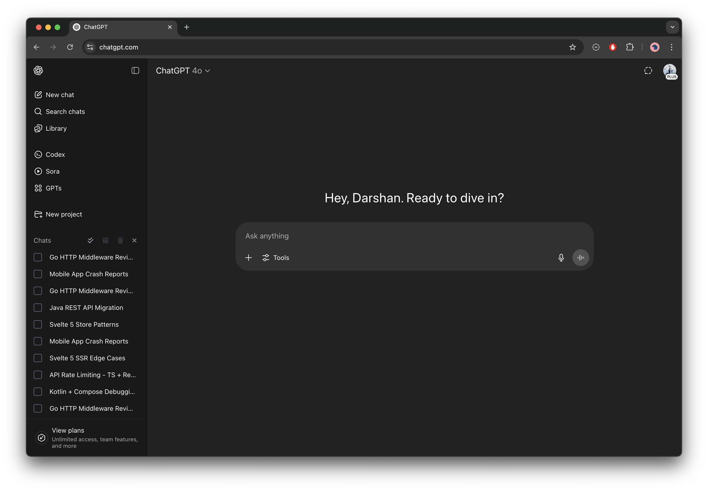
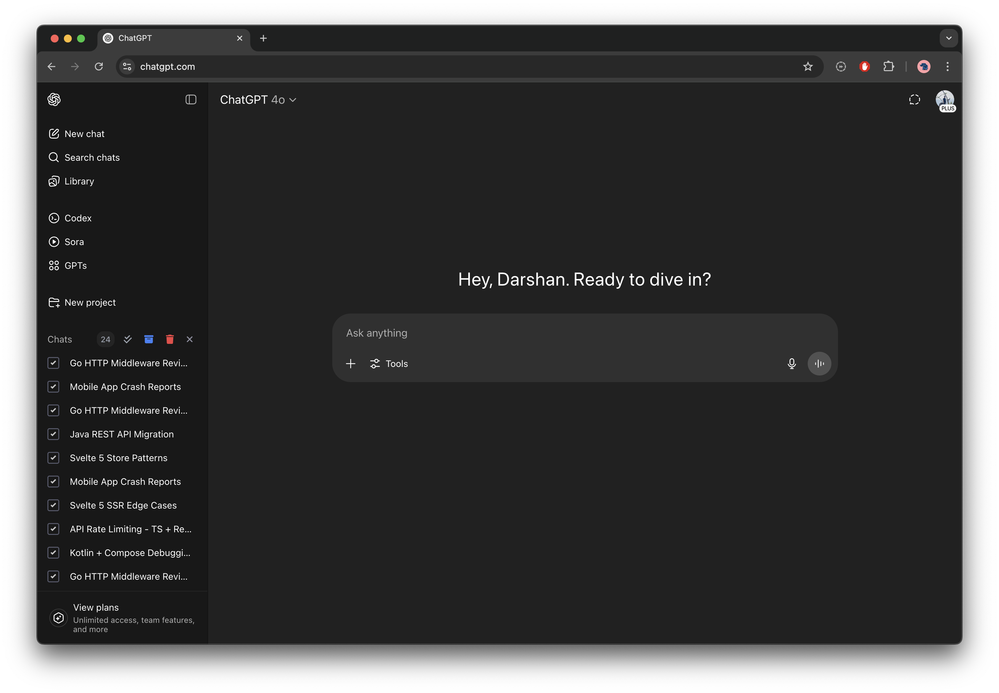

  

   <h1 style="margin: -0.5rem 0;">ChatGPT Bulk Actions Extension</h1>

   
<em>Because ChatGPT still doesn't let you archive or delete multiple chats at once — so here we are.</em>

---

  
  
  

## 📸 Screenshots

    
    

## 🔧 Installation

1. **Download & Unzip**  
   Grab this repo and unzip it somewhere.

2. **Load the Extension**
    - Open `chrome://extensions`, and click **“Load Unpacked”**.
    - Select the folder you just unzipped.

3. **Done**  
   Head to [ChatGPT](https://chatgpt.com) and start bulk selecting from the sidebar.

---

## ✨ Features

- Toggle selection mode
- Select multiple chats
- Archive or delete selected chats in one go
- Get Chrome native notifications for results

---

## ⚠️ Technical Note

This extension works by injecting UI elements directly into ChatGPT's sidebar using DOM manipulation.  
While not the cleanest method, it’s fast, reliable, and gets the job done, for now — until OpenAI adds native support.

---

This exists because "eventually" isn't a product roadmap.
